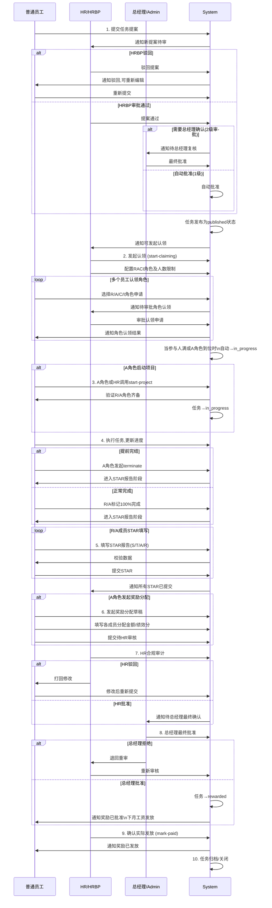
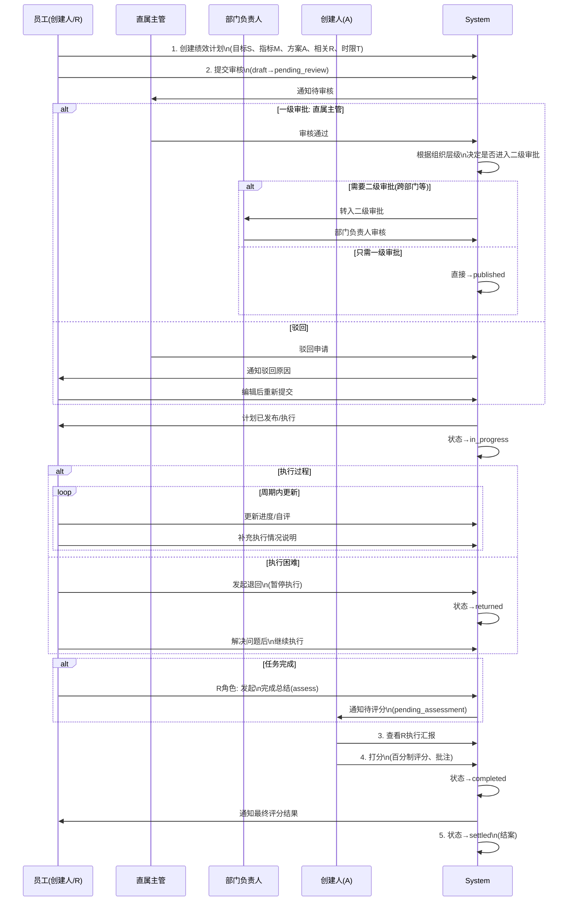
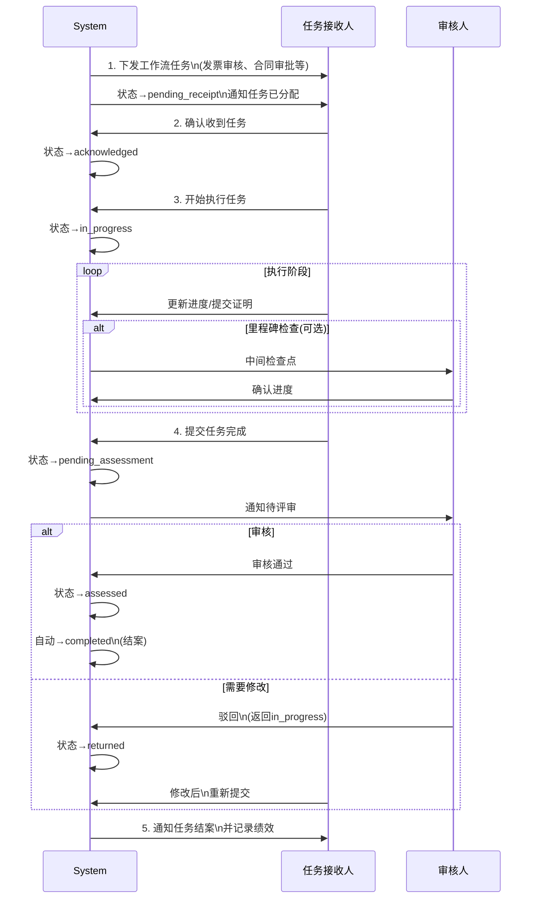
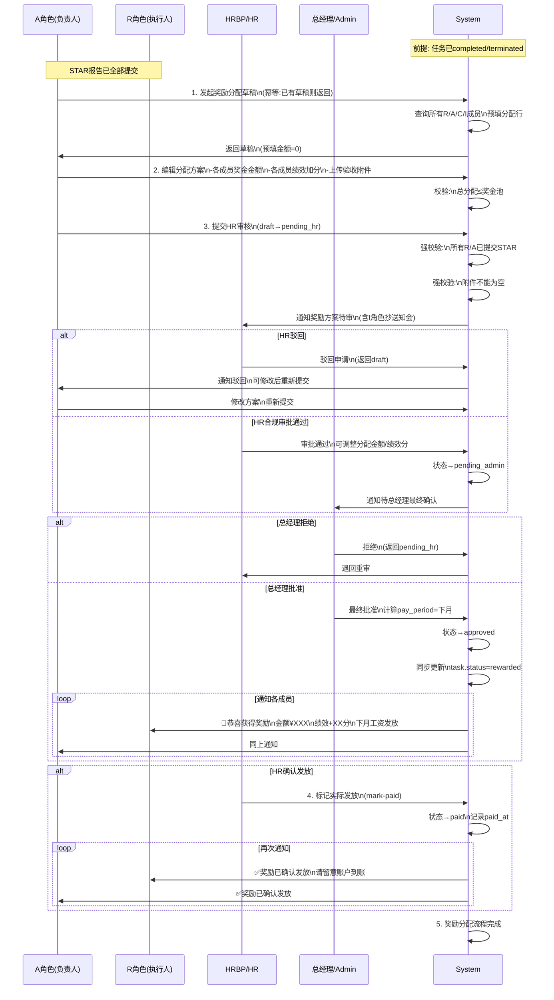
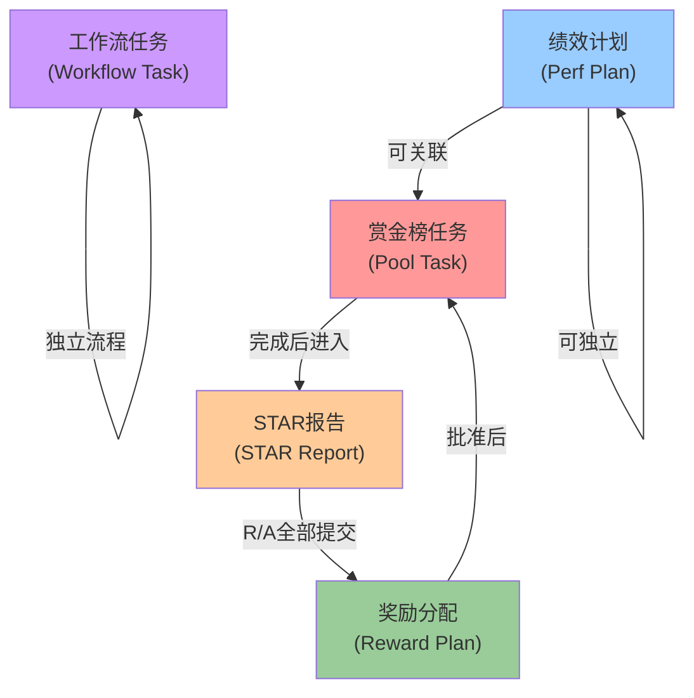

# HRM 系统 4 大流程 Mermaid 图

## 1. 赏金榜任务流程 (Bounty Board Task Flow)

### 1.1 状态流转图

```mermaid
stateDiagram-v2
    [*] --> Draft: 用户/HR创建提案
    
    Draft --> PendingHR: 提案人提交审核
    Draft --> Rejected: HR驳回
    Rejected --> Draft: 提案人重新编辑
    
    PendingHR --> PendingAdmin: HRBP审核通过
    PendingHR --> Rejected: HRBP驳回
    
    PendingAdmin --> Approved: 总经理确认
    PendingAdmin --> PendingHR: 总经理退回
    
    Approved --> Published: 自动发布
    
    Published --> Claiming: HR发起认领
    
    Claiming --> InProgress: A角色确认\n或参与人满员+A角色到位
    
    InProgress --> Completed: 执行人/A角色\n标记100%完成
    InProgress --> Terminated: A角色发起\n提前完结
    
    Completed --> StarPhase: 进入STAR报告阶段
    Terminated --> StarPhase: 进入STAR报告阶段
    
    StarPhase --> RewardPhase: 所有R/A提交STAR
    
    RewardPhase --> Rewarded: 总经理批准\n奖励分配
    
    Rewarded --> Closed: 任务归档/关闭
    Closed --> [*]
    
    InProgress --> Closed: 管理员强制关闭
    
    Published -.-> Trash: 软删除
    Trash -.-> Published: 恢复
    Trash -.-> [*]: 永久删除
    
    note right of Draft
        提案状态: draft
        任务状态: 无
    end
    
    note right of PendingHR
        提案状态: pending_hr
        任务状态: proposing(若提案)
    end
    
    note right of Approved
        提案状态: approved
        任务状态: published
    end
    
    note right of StarPhase
        等待R/A填写STAR报告
        pool_role_claims.status='star_submitted'
    end
    
    note right of RewardPhase
        奖励分配流程(见流程4)
        pool_reward_plans状态转移
    end
```

### 1.2 参与者泳道图 - 赏金榜任务



---

## 2. 绩效计划流程 (Performance Plan Flow)

### 2.1 状态流转图

```mermaid
stateDiagram-v2
    [*] --> Draft: 创建绩效计划\n(目标、OKR、专项任务)
    
    Draft --> PendingReview: 提交审核
    
    alt 一级审批(直接上级)
        PendingReview --> PendingDeptReview: 直接上级\n审批通过
        PendingReview --> Rejected: 直接上级\n驳回
    else 二级审批(部门负责人)
        PendingReview --> PendingDeptReview: 跳过\n(多级组织)
    end
    
    PendingDeptReview --> Published: 部门负责人\n审批通过
    PendingDeptReview --> Rejected: 部门负责人\n驳回
    
    Rejected --> Draft: 编辑后\n重新提交
    
    Published --> InProgress: 自动进入执行\n或手动发起执行
    
    InProgress --> PendingAssessment: R/A发起\n完成总结
    InProgress --> Returned: 管理员\n暂时退回
    
    Returned --> InProgress: R/A\n继续执行
    
    PendingAssessment --> Completed: 任务创建人\n打分完成
    
    Completed --> Settled: 完成归档/结案
    Settled --> [*]
    
    Draft --> [*]: 删除(仅创建人)
    
    Draft -.-> PendingReview: 撤回\n(待审状态)
    
    note right of Draft
        状态: draft
        操作: 编辑、提交、删除
        权限: 创建人
    end
    
    note right of PendingReview
        状态: pending_review
        等待: 直接上级(直属主管)审批
        操作: 撤回(待审)、转办
    end
    
    note right of PendingDeptReview
        状态: pending_dept_review
        等待: 部门负责人审批
        操作: 转办
    end
    
    note right of InProgress
        状态: in_progress
        执行: R角色执行,A角色验收
        操作: 进度更新、退回、完成总结
    end
    
    note right of PendingAssessment
        状态: pending_assessment
        等待: 任务创建人评分
        操作: 打分、完成
    end
```

### 2.2 参与者泳道图 - 绩效计划



---

## 3. 工作流任务流程 (Workflow Task Flow)

### 3.1 状态流转图

```mermaid
stateDiagram-v2
    [*] --> Published: 系统发起\n工作流任务
    
    Published --> PendingReceipt: 任务下发\n给指定人员
    
    PendingReceipt --> Acknowledged: 任务接收人\n确认收到
    
    Acknowledged --> InProgress: 开始\n执行任务
    
    InProgress --> PendingAssessment: 执行人\n提交任务完成\n(可选里程碑)
    
    PendingAssessment --> Assessed: 审核人\n评审完成
    
    Assessed --> Completed: 自动结案
    
    Completed --> [*]
    
    InProgress -.-> Returned: 审核人\n退回修改
    Returned --> InProgress: 继续\n执行
    
    note right of Published
        工作流任务自动下发
        无人为干预的流程节点
    end
    
    note right of PendingReceipt
        状态: pending_receipt
        等待: 任务接收人确认
    end
    
    note right of InProgress
        状态: in_progress
        执行: 指定受理人执行
        可选: 里程碑节点
    end
    
    note right of PendingAssessment
        状态: pending_assessment
        等待: 审核人评审
    end
```

### 3.2 参与者泳道图 - 工作流任务



---

## 4. 奖励分配流程 (Reward Distribution Flow)

### 4.1 状态流转图

```mermaid
stateDiagram-v2
    [*] --> Draft: A角色发起\n奖励分配草稿\n(仅completed/terminated任务)
    
    Draft --> EditDistribution: A角色编辑\n各成员分配金额\n&绩效加分
    EditDistribution --> Draft: 保存草稿
    
    Draft --> PendingHR: A角色提交\nHR合规审计\n(须所有R/A提交STAR)
    
    PendingHR --> Draft: HR驳回\n需修改方案
    
    PendingHR --> PendingAdmin: HRBP\n合规审批通过\n(可调整分配)
    
    PendingAdmin --> Draft: 总经理\n退回重审
    
    PendingAdmin --> Approved: 总经理\n最终批准
    
    Approved --> Paid: HR确认\n实际发放\n(mark-paid)
    
    Paid --> [*]
    
    note right of Draft
        状态: draft
        操作: 编辑分配、提交、删除
        权限: A角色(初期)或无草稿时幂等创建
    end
    
    note right of PendingHR
        状态: pending_hr
        验证: 所有R/A已提交STAR
        验证: 附件已上传(验收证明)
        操作: 转办HRBP
    end
    
    note right of PendingAdmin
        状态: pending_admin
        校验: 分配总额≤奖金池
        操作: 调整分配、转办
    end
    
    note right of Approved
        状态: approved
        计算: pay_period = 下月
        通知: 各成员已批准
    end
    
    note right of Paid
        状态: paid
        记录: paid_at时间戳
        通知: 确认发放
    end
```

### 4.2 参与者泳道图 - 奖励分配



---

## 流程关键属性速查表

### 任务状态速查

| 流程 | 状态值 | 含义 | 权限 |
|------|--------|------|------|
| **赏金榜** | draft | 提案草稿 | 创建人编辑 |
| | pending_hr | HRBP审批 | HR/HRBP审批 |
| | pending_admin | 总经理复核 | 总经理审批 |
| | approved | 已批准 | 发布为published |
| | published | 已发布 | 员工可认领 |
| | claiming | 认领阶段 | HR配置RACI |
| | in_progress | 执行中 | R/A执行 |
| | completed | 已完成100% | 进入STAR阶段 |
| | terminated | 提前完结 | 进入STAR阶段 |
| | rewarded | 已发赏 | 最终状态 |
| | closed | 已关闭 | 归档 |
| **绩效计划** | draft | 草稿 | 创建人编辑 |
| | pending_review | 一级审批 | 直属主管审批 |
| | pending_dept_review | 二级审批 | 部门负责人审批 |
| | published | 已发布 | 进入执行 |
| | in_progress | 执行中 | R执行,A验收 |
| | pending_assessment | 待评分 | 创建人打分 |
| | completed | 已完成 | 进入结案 |
| | settled | 已结案 | 最终 |
| **工作流任务** | pending_receipt | 待接收 | 任务人确认 |
| | acknowledged | 已确认 | 开始执行 |
| | in_progress | 执行中 | 任务人执行 |
| | pending_assessment | 待评审 | 审核人评审 |
| | assessed | 已评审 | 自动结案 |
| | completed | 已完成 | 最终 |
| **奖励分配** | draft | 草稿 | A角色编辑 |
| | pending_hr | HR审计 | HRBP审批 |
| | pending_admin | 总经理确认 | 总经理审批 |
| | approved | 已批准 | HR发放 |
| | paid | 已发放 | 最终 |

### 核心表字段映射

| 表名 | 关键字段 | 用途 |
|------|---------|------|
| pool_tasks | status, proposal_status | 赏金榜任务状态 |
| pool_role_claims | status, role_name, pool_task_id, user_id | RACI角色分配 |
| pool_star_reports | is_submitted, situation, task_desc, action, result | STAR报告内容 |
| pool_reward_plans | status, total_bonus, pay_period | 奖励分配方案 |
| perf_plans | status, creator_id, assignee_id | 绩效计划 |
| workflow_nodes | status, skip_rule | 工作流节点 |

---

## 流程交互关系


