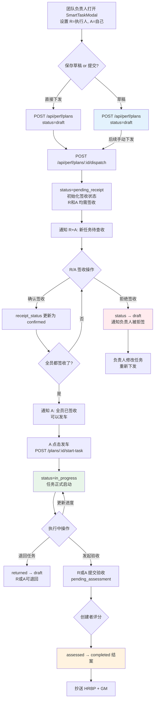
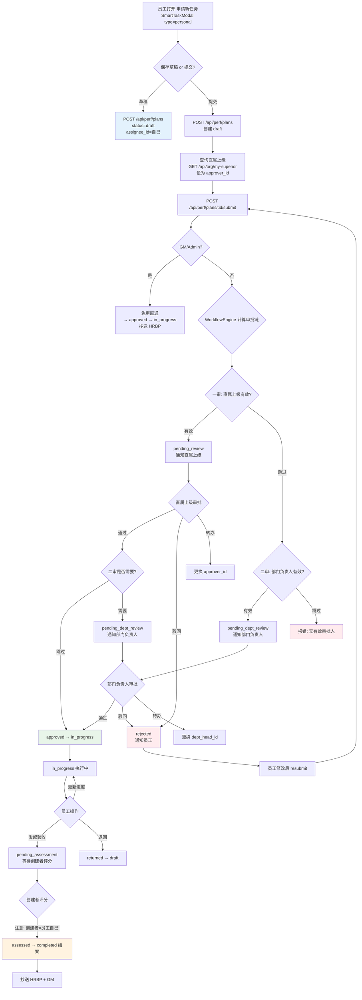
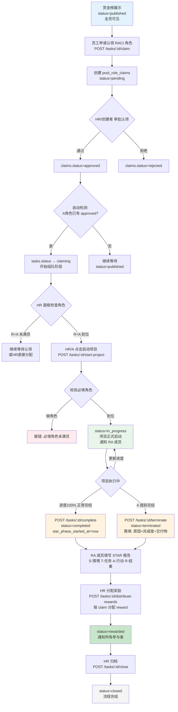

# HRM 四大流程全景图

## 流程一：任务下发 (perf_plans — 团队负责人指派)

**入口**: TeamPerformance → "指派任务" → SmartTaskModal
**表**: perf_plans
**关键字段**: creator_id=负责人, assignee_id=执行人(R), approver_id=负责人(A)
**核心机制**: 下发签收制（无审批链），全员签收后 A 发车



### 任务下发状态机
```
draft → pending_receipt (下发签收)
pending_receipt → in_progress (A发车，全员已签收)
pending_receipt → draft (有人拒签)
in_progress → pending_assessment (R/A发起验收)
in_progress → returned → draft (退回重编)
pending_assessment → assessed → completed (创建者评分结案)
```

### 签收机制详解
- 下发时收集 R + A 的 userId 列表
- 每人独立签收 (`confirm-receipt`) 或拒签 (`reject-receipt`)
- 任一人拒签 → 任务退回 draft
- 全员确认 → 仅 A(负责人) 有权"发车"启动任务

---

## 流程二：任务申请 (perf_plans — 员工自主申请)

**入口**: TeamPerformance → "申请新任务" / PersonalGoals / PersonalGoalsPanel → SmartTaskModal
**表**: perf_plans
**关键字段**: creator_id=员工自己, assignee_id=员工自己(R), approver_id=直属上级
**核心机制**: 审批链制（直属上级→部门负责人）



### 任务申请状态机
```
draft → pending_review (一审: 直属上级)
pending_review → pending_dept_review (二审: 部门负责人)
pending_review → approved(→in_progress) (一审直接通过)
pending_review → rejected → draft
pending_dept_review → approved(→in_progress)
pending_dept_review → rejected → draft
in_progress → pending_assessment → assessed → completed
in_progress → returned → draft
```

### 任务下发 vs 任务申请 关键区别

| 维度 | 任务下发 | 任务申请 |
|------|---------|---------|
| **发起人** | 团队负责人 | 员工自己 |
| **执行人(R)** | 被指派的下属 | 员工自己 |
| **负责人(A)** | 负责人自己 | 员工的直属上级 |
| **启动机制** | 签收制: dispatch → 全员签收 → A发车 | 审批制: submit → 上级审批 → 自动启动 |
| **审批链** | 无（直接下发签收） | 直属上级 → 部门负责人 |
| **评分人** | creator_id (负责人) | creator_id (员工自己!) |
| **潜在问题** | - | 自己给自己打分 |

---

## 流程三：提案审批 (pool_tasks — 提案流程)

**入口**: CompanyPerformance → "发布提案" → SmartTaskModal
**表**: pool_tasks
**双状态架构**: proposal_status 管审批流程, status 管任务生命周期
**审批链**: HR(HRBP) → GM(总经理)

```mermaid
flowchart TD
    A[任何员工打开 CompanyPerformance<br/>点击发布提案] --> B{保存草稿 or 提交?}
    B -->|草稿| C[POST /api/pool/tasks<br/>proposal_status=draft<br/>status=proposing]
    B -->|提交| D{发起人身份?}
    
    D -->|GM/Admin| E[免审直通<br/>proposal_status=approved<br/>status=published<br/>通知全员 + 抄送HR]
    D -->|普通员工| F{WorkflowEngine 审批链}
    
    F --> G{HR(HRBP)节点有效?}
    G -->|有效| H[proposal_status=pending_hr<br/>status=proposing<br/>通知 HRBP 审批]
    G -->|跳过| I{GM节点有效?}
    I -->|有效| J[proposal_status=pending_admin<br/>通知 GM]
    I -->|跳过| K[proposal_status=approved<br/>status=published]
    
    H --> L{HR 审批操作}
    L -->|通过| M{GM 免审?<br/>HR=GM 或 GM 跳过}
    L -->|编辑SMART+通过| M
    L -->|驳回| N[proposal_status=rejected<br/>通知提案人]
    
    M -->|免审| O[直接 approved + published<br/>通知全员]
    M -->|需GM复核| P[pending_admin<br/>通知 GM 复核]
    
    P --> Q{GM 复核操作}
    Q -->|通过| R[proposal_status=approved<br/>status=published<br/>全员可见]
    Q -->|编辑SMART+通过| R
    Q -->|驳回| N
    
    N --> S[提案人修改草稿]
    S --> T[resubmit<br/>proposal_status=pending_hr]
    
    C --> U[草稿列表<br/>可编辑/删除/提交]
    U --> D
    
    R --> V[进入赏金榜<br/>等待认领]
    O --> V
    E --> V

    style C fill:#e3f2fd
    style R fill:#e8f5e9
    style E fill:#e8f5e9
    style O fill:#e8f5e9
    style N fill:#ffebee
```

### 提案审批状态机 (proposal_status)
```
draft → pending_hr → pending_admin → approved
                   → approved (GM免审直通)
                   → rejected → draft
       pending_admin → approved
                     → rejected → draft
```

### HR/GM 审批时可编辑字段
- SMART 字段 (S/M/A/R/T) — 重建 description
- PDCA 时间 (plan_time/do_time/check_time/act_time)
- 奖金金额 (bonus)、奖励类型 (reward_type)
- 人数上限 (max_participants)、分类 (category)
- 附件 (attachments)
- 标题 (title/summary)

---

## 流程四：赏金榜任务 (pool_tasks — 认领到完结)

**入口**: CompanyPerformance 赏金榜 → 认领角色
**表**: pool_tasks + pool_role_claims
**前置条件**: 提案审批通过后 status=published



### 赏金榜任务状态机 (pool_tasks.status)
```
proposing → published  (提案审批通过)
published → claiming   (A角色认领通过)
claiming  → in_progress (HR/A启动项目, R+A满员)
in_progress → completed   (满分完结, progress=100%)
in_progress → terminated  (A提前完结, 需说明原因)
completed/terminated → rewarded (HR发赏)
rewarded → closed (HR归档)
```

### 角色认领状态机 (pool_role_claims.status)
```
pending → approved  (HR/创建者审批通过)
pending → rejected  (拒绝)
```

### RACI 角色说明
| 角色 | 含义 | 必填 | 人数限制 | 启动校验 |
|------|------|------|---------|---------|
| R | 执行者 Responsible | 是 | 由 roles_config 定义 | 必须满员 |
| A | 责任验收者 Accountable | 是 | 通常 max=1 | 必须有人 |
| C | 被咨询者 Consulted | 否 | 无限制 | 不校验 |
| I | 被告知者 Informed | 否 | 无限制 | 不校验 |

---

## 四流程对比总览

| 维度 | 流程一: 任务下发 | 流程二: 任务申请 | 流程三: 提案审批 | 流程四: 赏金榜 |
|------|:---:|:---:|:---:|:---:|
| **数据表** | perf_plans | perf_plans | pool_tasks | pool_tasks + claims |
| **发起人** | 团队负责人 | 员工自己 | 任何人 | 提案通过后自动 |
| **执行人** | 被指派下属 | 员工自己 | N/A | RACI 认领 |
| **启动机制** | 签收制 (dispatch) | 审批制 (submit) | HR→GM 审批 | 认领→启动项目 |
| **审批链** | 无 | 上级→部门负责人 | HR→GM | N/A |
| **评分人** | 任务创建者 | 创建者(=自己!) | N/A | N/A |
| **奖励发放** | 无 | 无 | N/A | HR 按 claim 分配 |
| **完结方式** | 验收评分→结案 | 验收评分→结案 | 审批通过→发布 | STAR→发赏→归档 |
| **入口** | TeamPerformance | TeamPerf/PersonalGoals | CompanyPerformance | CompanyPerformance |

---

## 已知问题标注

### 流程二: 自己给自己评分
任务申请时 `creator_id = assignee_id = 员工自己`，而评分人逻辑取 `creator_id`，导致员工自己给自己打分。

### 流程三+四: PDCA 覆盖风险 (已修复)
HR/GM 审批时编辑 SMART 但未传 PDCA 时间时，原有 PDCA 会被空字符串覆盖。已修复为 fallback 到数据库原值。

### 流程四: start-project PDCA 覆盖 (已修复)
启动项目时编辑 SMART 但未传 PDCA 时，同上问题。已修复。
